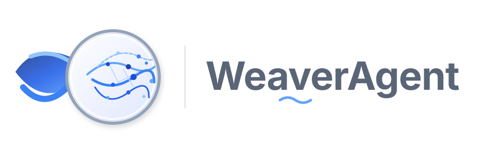

<div align="center">



A GraphRAG-Powered Academic Knowledge Graph Analysis Engine
</br>
<em>基于 GraphRAG 的学术知识图谱分析引擎</em>

[English](./README-EN.md) | [中文文档](./README.md)

</div>

## ⚡ Overview

**WeaverAgent** is a GraphRAG-powered academic knowledge graph analysis engine. Upload PDF papers and the system automatically extracts entities and relationships to build an academic knowledge graph covering core dimensions such as methods, innovations, datasets, and metrics. Leveraging GraphRAG's multi-hop reasoning capabilities, it generates in-depth technical pathway analysis reports and supports natural language Q&A over graph entities.

> You only need to: Upload a batch of PDF papers and describe your analysis requirements in natural language</br>
> WeaverAgent will return: A structured academic knowledge graph, a technical pathway analysis report, and an interactive Q&A system

### Core Capabilities

- **Automatic Ontology Design**: LLM analyzes paper content and generates 8 core entity types (Paper, Method, Innovation, Task, Dataset, Metric, Baseline, Author) with their relationships
- **GraphRAG Construction**: Builds high-quality knowledge graphs via Zep Cloud with multi-hop relationship reasoning
- **Deep Analysis Reports**: ReportAgent autonomously searches the graph, reflects and reasons, generating structured technical pathway analysis reports
- **Interactive Q&A**: Hybrid RAG combining graph and vector retrieval for precise answers to technical provenance questions

## 🔄 Workflow

1. **Graph Building**: PDF parsing → text extraction → LLM ontology generation → Zep GraphRAG construction
2. **Environment Setup**: Entity-relationship visualization → graph statistics → analysis parameter configuration
3. **Graph Analysis**: Node/edge type distribution → hub node identification → technical pathway analysis
4. **Report Generation**: ReportAgent multi-round graph retrieval → ReACT reasoning → section-by-section report generation
5. **Deep Interaction**: Chat with ReportAgent → graph entity Q&A → RAG paragraph retrieval

## 🚀 Quick Start

### Option 1: Source Code Deployment (Recommended)

#### Prerequisites

| Tool | Version | Description | Check Installation |
|------|---------|-------------|-------------------|
| **Node.js** | 18+ | Frontend runtime, includes npm | `node -v` |
| **Python** | ≥3.11, ≤3.12 | Backend runtime | `python --version` |
| **uv** | Latest | Python package manager | `uv --version` |

#### 1. Configure Environment Variables

```bash
# Copy the example configuration file
cp .env.example .env

# Edit the .env file and fill in the required API keys
```

**Required Environment Variables:**

```env
# LLM API Configuration (supports any LLM API with OpenAI SDK format)
# Recommended: Alibaba Qwen-plus model via Bailian Platform: https://bailian.console.aliyun.com/
LLM_API_KEY=your_api_key
LLM_BASE_URL=https://dashscope.aliyuncs.com/compatible-mode/v1
LLM_MODEL_NAME=qwen-plus

# Zep Cloud Configuration (required for GraphRAG construction)
# Free monthly quota is sufficient for simple usage: https://app.getzep.com/
ZEP_API_KEY=your_zep_api_key
```

**Optional Environment Variables:**

```env
# Neo4j Configuration (local graph database for advanced retrieval scenarios)
NEO4J_URI=bolt://localhost:7687
NEO4J_USER=neo4j
NEO4J_PASSWORD=your_password

# Report Agent Configuration
REPORT_AGENT_MAX_TOOL_CALLS=5
REPORT_AGENT_MAX_REFLECTION_ROUNDS=2
REPORT_AGENT_TEMPERATURE=0.5
```

#### 2. Install Dependencies

```bash
# One-click installation of all dependencies (root + frontend + backend)
npm run setup:all
```

Or install step by step:

```bash
# Install Node dependencies (root + frontend)
npm run setup

# Install Python dependencies (backend, auto-creates virtual environment)
npm run setup:backend
```

#### 3. Start Services

```bash
# Start both frontend and backend (run from project root)
npm run dev
```

**Service URLs:**
- Frontend: `http://localhost:3000`
- Backend API: `http://localhost:5001`

**Start Individually:**

```bash
npm run backend   # Start backend only
npm run frontend  # Start frontend only
```

**Shell Script:**

```bash
./start.sh   # One-click start
./stop.sh    # One-click stop
```

### Option 2: Docker Deployment

```bash
# 1. Configure environment variables (same as source deployment)
cp .env.example .env

# 2. Pull image and start
docker compose up -d
```

Reads `.env` from root directory by default, maps ports `3000 (frontend) / 5001 (backend)`

> Mirror address for faster pulling is provided as comments in `docker-compose.yml`, replace if needed.

## 🏗️ Tech Stack

| Layer | Stack |
|-------|-------|
| Frontend | Vue 3 + Vue Router 4 + Vite + D3.js (graph visualization) |
| Backend | Flask 3 + Flask-CORS |
| Graph Engine | Zep Cloud (GraphRAG) + Neo4j (optional local graph DB) |
| LLM | OpenAI SDK format (compatible with Qwen, GPT, Claude, etc.) |
| Vector Retrieval | ChromaDB (RAG paragraph retrieval) |
| File Processing | PyMuPDF (PDF parsing) + charset-normalizer |

## 📄 Acknowledgments

**WeaverAgent has received strategic support and incubation from Shanda Group!**
